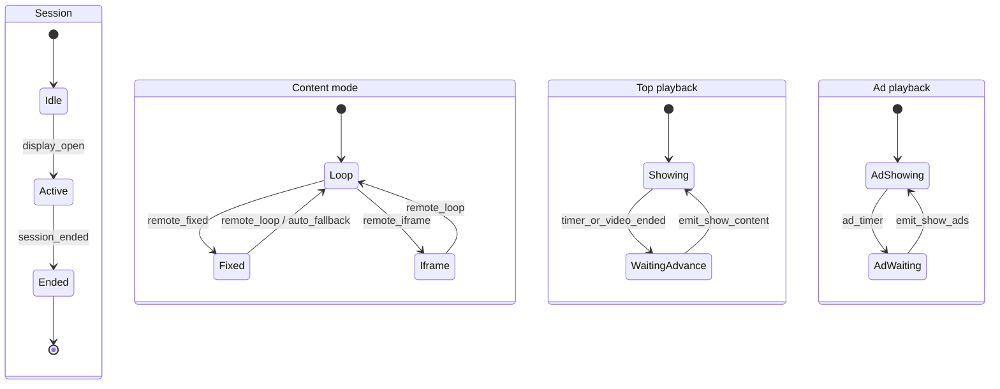
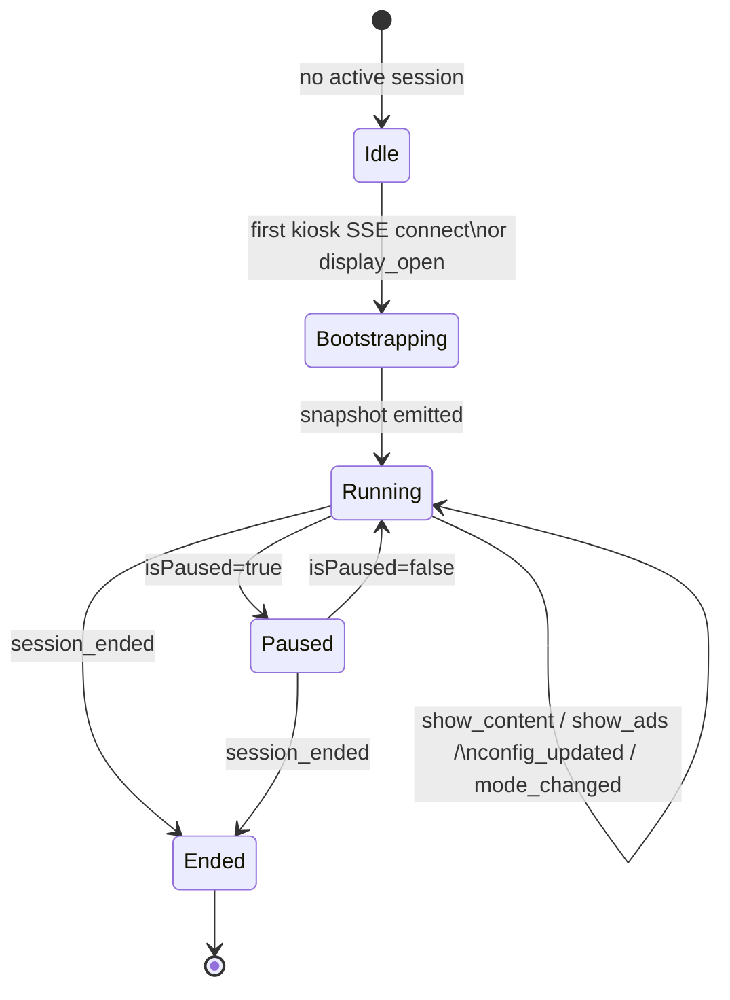
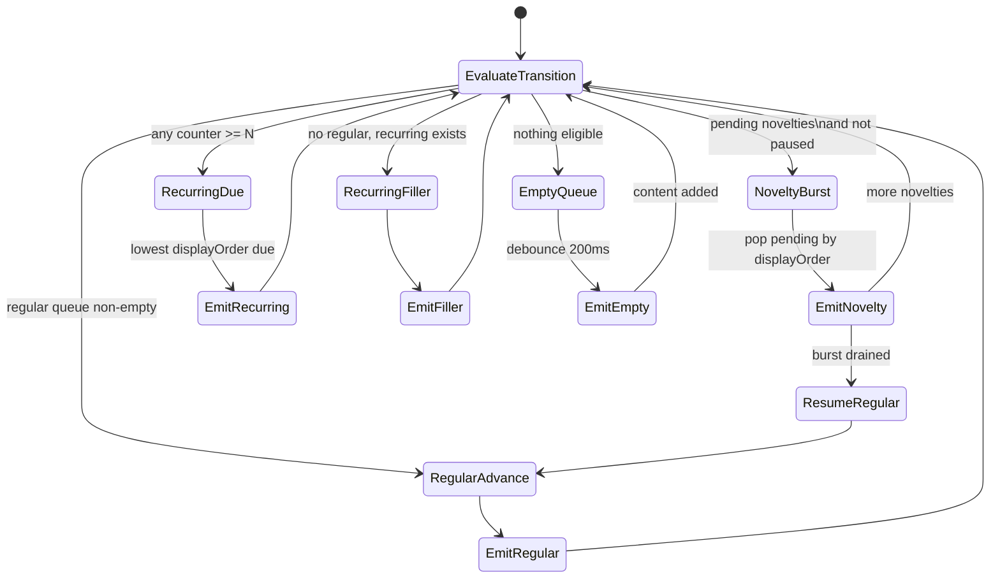
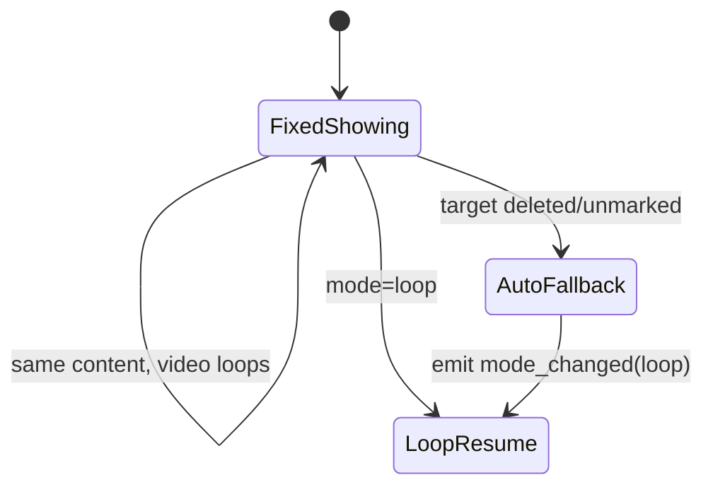
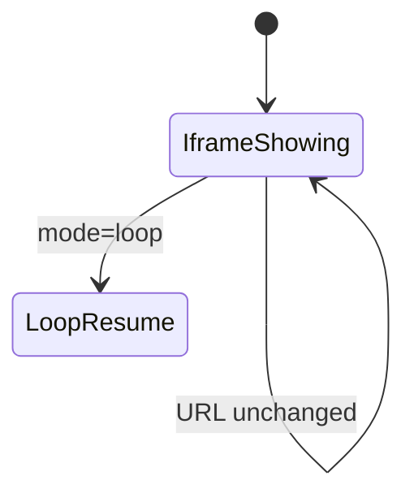
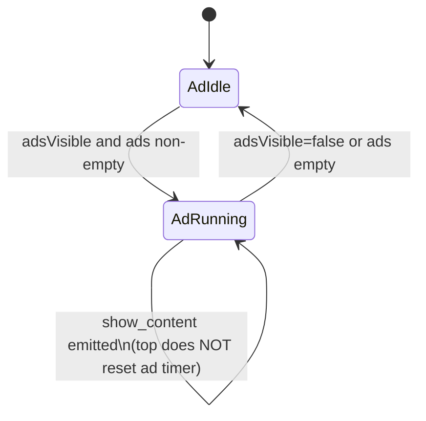
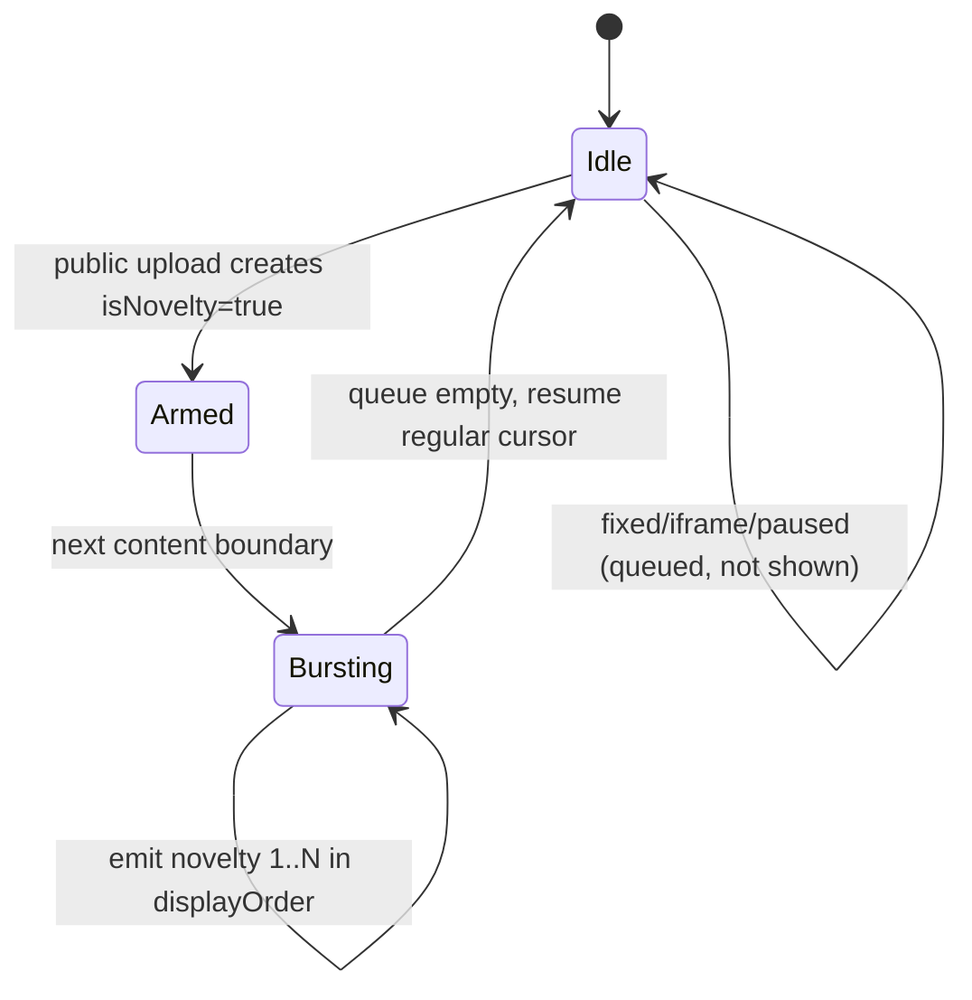
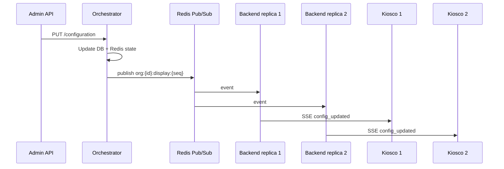

# Orchestrator State Machine (CHG-041)

**Target**: `DisplayOrchestrator` (backend, new)
**Replaces**: `KioskRotationController` timer ownership (frontend)
**Parity contracts**: `CONTENT.ROTATION`, `DISPLAY.CONTROL`, CHG-027, CHG-039

## State model overview

The orchestrator maintains **orthogonal state machines** that run concurrently:



**Key invariant**: Top and ad machines are **independent** (FR-012). A top
`show_content` must not reset the ad timer.

---

## Persistent state (Redis)

Key: `orchestrator:{organizationId}:{sessionId}`

```json
{
  "contentMode": "loop",
  "isPaused": false,
  "adsVisible": true,
  "selectedIframeId": null,
  "selectedFixedContentId": null,

  "currentTopCommandId": "cmd-...",
  "currentTopContentId": "uuid",
  "currentAdCommandId": "cmd-...",
  "currentAdStartIndex": 0,

  "regularCursorId": "uuid",
  "fillerCursorId": "uuid",
  "loopCursorBeforeFixed": "uuid",

  "recurringCounters": {
    "content-uuid": 3
  },

  "noveltyBurstActive": false,
  "resumeRegularCursorId": "uuid",
  "pendingNoveltyIds": ["uuid-1", "uuid-2"],

  "topTimerDeadline": "2026-07-08T11:00:10Z",
  "adTimerDeadline": "2026-07-08T11:00:08Z",

  "sequence": 42
}
```

Playlist snapshots (eligible top content, ads) are read from PostgreSQL on
each mutation, not cached long-term in Redis.

---

## Top-level orchestrator states



### `Bootstrapping`

1. Load configuration + eligible playlists from DB.
2. Initialize cursors (regular queue head, ad index 0).
3. Emit `snapshot` with `currentTop` and `currentAds`.
4. Arm top and ad timers.

### `Running`

Accepts triggers (see **Trigger table** below). Each trigger may:

- Mutate Redis state
- Emit one or more SSE events
- Re-arm one or both timers

### `Paused`

- Top timer **frozen**; remaining seconds stored in `topTimerRemainingMs`.
- Ad timer **continues** (FR-011/FR-012a parity: ads keep rotating in pause).
- `video_ended` and top duration timeouts are ignored.
- Remote `next`/`previous`/`jump_to` still honored (exits effective pause for
  that action — same as today).

### `Ended`

- Cancel all timers.
- Close SSE with `session_ended` event.
- Redis key TTL 1 h for debugging.

---

## Content mode substates

### Loop mode (default)



#### Transition algorithm (pseudocode)

On each **content transition** (timer, `video_ended`, remote navigation):

```
function advanceTop():
  if isPaused and trigger != remote_navigation:
    return

  if contentMode != "loop":
    return  // fixed/iframe handled separately

  if noveltyBurstActive or hasPendingNovelties():
    item = popNextNovelty()
    if item:
      consumeNoveltyInDb(item.id)   // server-side, replaces CHG-027 race
      emit show_content(item, reason=novelty)
      return
    noveltyBurstActive = false
    // fall through to resume regular cursor

  incrementRecurringCounters()      // skip if resuming from novelty mid-burst

  due = pickDueRecurring(lowest displayOrder, counter >= N)
  if due:
    resetCounter(due.id)
    emit show_content(due, reason=recurring_due)
    return

  if regularQueue not empty:
    next = pickNext(regularQueue, regularCursorId)
    regularCursorId = next.id
    emit show_content(next, reason=rotation_advance)
    return

  if recurringFillerQueue not empty:
    next = pickNext(fillerQueue, fillerCursorId)
    fillerCursorId = next.id
    emit show_content(next, reason=rotation_advance)
    return

  scheduleEmptyQueueAudit()
```

**Counter rules (CHG-039 parity)**:

| Event | Counters |
|---|---|
| Content transition in loop | All recurring +1 (except during pause) |
| Show due recurring | Reset only that item's counter |
| Novelty slide | Do not increment |
| Pause | Freeze increments |
| `jump_to` recurring X | Show X; reset only X's counter |
| Config change to item's N | Reset only that item's counter |

### Fixed mode



- Emit `show_content` once with `playback.mode = fixed_loop` for video.
- Photos use `playback.mode = manual` (static).
- Store `loopCursorBeforeFixed` on entry (FR-015).
- On exit to loop: `regularCursorId = pickNext after loopCursorBeforeFixed`.

### Iframe mode



- Emit `show_iframe`; top timer idle.
- Ads continue independently if `adsVisible`.

---

## Ad rotation substates (all modes)



On ad timer fire:

```
adStartIndex = (adStartIndex + 1) % ads.length
emit show_ads(slice from adStartIndex, inlineAdCount)
rearm ad timer with defaultAdDurationSeconds
```

---

## Trigger table

| Trigger | Source | Actions |
|---|---|---|
| `display_open` | HTTP | End old sessions; bootstrap; fan-out snapshot |
| `timer_top` | asyncio | `advanceTop()` if not paused |
| `timer_ad` | asyncio | `advanceAd()` |
| `video_ended` | HTTP kiosk event | `advanceTop()` if commandId matches current |
| `remote_navigation` | HTTP | Map command → `advanceTop`, pause, jump |
| `remote_mode_change` | HTTP | Switch mode substate; emit `mode_changed` + show_* |
| `config_updated` | HTTP admin | Emit `config_updated`; maybe defer playlist |
| `content_mutated` | HTTP admin/API | Refresh playlists; boundary or immediate per policy |
| `availability_tick` | background 30s | Re-evaluate eligibility; may trigger advance |
| `sse_connect` | SSE | Emit `snapshot` to connecting kiosk only |
| `session_superseded` | HTTP | `session_ended` to all |

---

## Remote navigation mapping

| Command | Loop behavior | Fixed | Iframe |
|---|---|---|---|
| `next` | `advanceTop()` forced | No-op | No-op |
| `previous` | Walk regular queue backwards | No-op | No-op |
| `pause` | `isPaused=true`, freeze top timer | freeze | freeze |
| `resume` | `isPaused=false`, rearm top timer | rearm if timed | n/a |
| `jump_to` X | Show X; if recurring reset X counter | n/a | n/a |

---

## Novelty burst state (CHG-027 parity)



Differences from CHG-027:

| CHG-027 (client) | CHG-041 (server) |
|---|---|
| First kiosk wins `consume-novelty` | Orchestrator consumes on emit |
| Second kiosk gets 409 | All kiosks receive same `show_content` |
| Detection on client transition | Detection on `content_mutated` trigger |

---

## Config mutation policy

| Changed field | SSE event | When applied |
|---|---|---|
| `topRegionRatio`, `bottomRegionRatio` | `config_updated` | Immediate |
| Border radius/width/color | `config_updated` | Immediate |
| `defaultTopDurationSeconds` | `config_updated` | Next top boundary |
| `defaultAdDurationSeconds` | `config_updated` | Next ad boundary |
| Content reorder/add/remove | none or `preload` | Next top boundary |
| `inlineAdCount` | `config_updated` | Next ad boundary |
| `isEnabled=false` | `session_ended` | Immediate |

---

## Availability scheduler

Background task every 30 s per active session:

1. Recompute `eligible_top_content` and `eligible_ads` (same rules as
   `display_service.py`).
2. If current top item became ineligible → force `advanceTop()`.
3. If new items became eligible → optionally `preload`; do not interrupt
   current slide.

---

## Fan-out flow



---

## Empty queue handling

Mirror `content_rotation_empty` audit (DISPLAY.EVENTS.AUDIT):

- Debounce 200 ms when `advanceTop()` finds no eligible content.
- Record event once per debounce window.
- Emit `show_content` with `playback.mode = manual` and fallback UI flag in
  snapshot (`fallbackActive: true`).

---

## Test matrix (must pass before Phase 4)

Port these scenario classes from `kiosk-rotation.controller.spec.ts`:

1. Ad timer survives top advance (FR-012)
2. Recurring due ordering by `displayOrder` (CHG-039)
3. Novelty burst preserves regular cursor (CHG-027)
4. Fixed mode entry/exit cursor (FR-015)
5. Pause freezes top not ads (FR-011)
6. `jump_to` recurring resets one counter
7. Auto-fallback fixed → loop
8. Idempotent `video_ended` for same `commandId`
