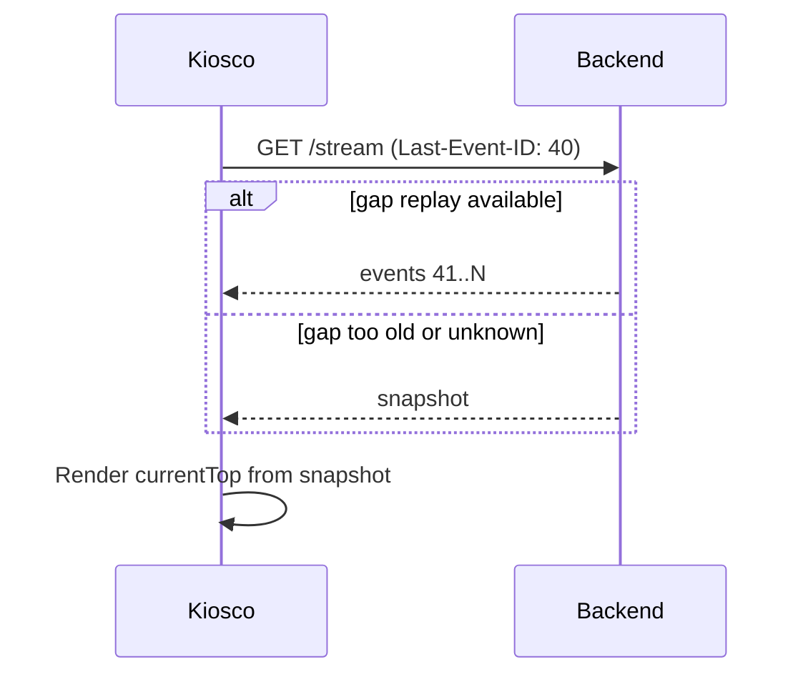

# SSE Display Protocol (CHG-041)

**Version**: `1`
**Transport**: `GET /api/display/stream`
**Content-Type**: `text/event-stream`
**ADR**: `docs/adr/0009-display-orchestration-sse.md`

## Connection lifecycle

### 1. Register kiosk

```http
POST /api/display/kiosk/register
Content-Type: application/json
Authorization: Bearer <session-token>   # or session cookie

{
  "label": "Hall A - left",              // optional, max 80 chars
  "clientInstanceId": "uuid-v4"          // required, stable per browser profile
}
```

**Response 201**

```json
{
  "kioskId": "550e8400-e29b-41d4-a716-446655440000",
  "organizationId": "...",
  "operatorSessionId": "...",
  "protocolVersion": 1
}
```

Rules:

- `clientInstanceId` is used to supersede duplicate tabs: a new registration
  with the same id disconnects the previous SSE connection with `session_ended`
  reason `superseded`.
- Registration requires an active operator session (`POST /display/open`).

### 2. Open SSE stream

```http
GET /api/display/stream?kioskId=550e8400-e29b-41d4-a716-446655440000
Accept: text/event-stream
Authorization: Bearer <session-token>    # or session cookie
Last-Event-ID: 42                        # optional, on reconnect
```

First event is always `snapshot`. Subsequent events carry monotonic `id` (SSE
standard) equal to `sequence`.

### 3. Kiosk → server events (HTTP)

```http
POST /api/display/kiosk/events
Content-Type: application/json

{
  "kioskId": "550e8400-e29b-41d4-a716-446655440000",
  "type": "video_ended",
  "commandId": "cmd-20260708-000042",
  "contentId": "content-uuid",
  "at": "2026-07-08T11:00:00.123Z",
  "metadata": {}
}
```

All requests are idempotent on `(kioskId, type, commandId)`.

---

## Envelope (all SSE data payloads)

Every `data:` line is a single JSON object:

```json
{
  "v": 1,
  "type": "<event-type>",
  "sequence": 42,
  "emittedAt": "2026-07-08T11:00:00.000Z",
  "operatorSessionId": "session-uuid",
  "organizationId": "org-uuid",
  "payload": { }
}
```

| Field | Type | Description |
|---|---|---|
| `v` | integer | Protocol version (=1) |
| `type` | string | Event type discriminator |
| `sequence` | integer | Monotonic per organization+session |
| `emittedAt` | ISO-8601 UTC | Server emission time |
| `operatorSessionId` | UUID | Active operator session |
| `organizationId` | UUID | Tenant scope |
| `payload` | object | Type-specific body |

SSE framing example:

```
id: 42
event: show_content
data: {"v":1,"type":"show_content","sequence":42,...}

```

---

## Server → kiosk event catalog

### `snapshot`

Full authoritative state after connect or unrecoverable gap. Replaces
`open_display` + initial poll.

```json
{
  "type": "snapshot",
  "payload": {
    "configuration": { /* KioskConfigurationSchema */ },
    "contentMode": "loop",
    "isPaused": false,
    "adsVisible": true,
    "selectedIframe": null,
    "currentTop": {
      "commandId": "cmd-...",
      "content": { /* ContentItemSchema */ },
      "transition": {
        "animation": "fade",
        "durationMs": 500
      }
    },
    "currentAds": {
      "commandId": "cmd-...",
      "items": [ /* AdItemSchema[] */ ],
      "startIndex": 0,
      "transition": {
        "animation": "fade",
        "durationMs": 500
      }
    },
    "fallbackActive": false
  }
}
```

### `show_content`

Instruct all kiosks to render a top-region slide.

```json
{
  "type": "show_content",
  "payload": {
    "commandId": "cmd-20260708-000043",
    "content": {
      "id": "uuid",
      "title": "Opening",
      "contentType": "photo",
      "sourceReference": "media://...",
      "mediaFile": {
        "mediaUrl": "/api/media/files/...",
        "contentType": "image/jpeg"
      },
      "effectiveDurationSeconds": 10,
      "effectiveRotationAnimation": "fade",
      "effectiveAnimationDurationMilliseconds": 500,
      "isNovelty": false
    },
    "playback": {
      "mode": "timer",
      "durationSeconds": 10,
      "videoEndDelaySeconds": 2,
      "loopVideo": false
    },
    "transition": {
      "animation": "fade",
      "durationMs": 500
    },
    "reason": "rotation_advance"
  }
}
```

`playback.mode`:

| Value | Server expects |
|---|---|
| `timer` | Advance after `durationSeconds` (photos) |
| `video` | Advance on first `video_ended` or `durationSeconds + videoEndDelaySeconds` timeout |
| `fixed_loop` | Video loops locally; server does not auto-advance |
| `manual` | No auto-advance (pause, empty queue) |

`reason` enum: `rotation_advance` | `remote_next` | `remote_previous` |
`remote_jump` | `novelty` | `recurring_due` | `availability` | `session_resume`

### `show_ads`

Update sponsor strip. Independent cadence from top content (FR-012).

```json
{
  "type": "show_ads",
  "payload": {
    "commandId": "cmd-20260708-000044",
    "items": [
      {
        "id": "ad-uuid",
        "sourceReference": "media://...",
        "mediaFile": { "mediaUrl": "/api/media/files/..." },
        "displayOrder": 1,
        "effectiveRotationAnimation": "fade",
        "effectiveAnimationDurationMilliseconds": 500
      }
    ],
    "startIndex": 2,
    "inlineAdCount": 3,
    "border": {
      "radiusPx": 5,
      "widthPx": 0,
      "color": "#ffffff"
    },
    "transition": {
      "animation": "fade",
      "durationMs": 500
    },
    "durationSeconds": 8,
    "reason": "ad_rotation"
  }
}
```

### `show_iframe`

```json
{
  "type": "show_iframe",
  "payload": {
    "commandId": "cmd-...",
    "iframe": {
      "id": "iframe-uuid",
      "title": "Live results",
      "url": "https://example.com/scoreboard"
    }
  }
}
```

### `mode_changed`

```json
{
  "type": "mode_changed",
  "payload": {
    "contentMode": "loop",
    "isPaused": true,
    "adsVisible": true,
    "selectedFixedContentId": null,
    "reason": "remote_pause"
  }
}
```

### `config_updated`

Layout and defaults without changing current slide (unless `applyImmediately`).

```json
{
  "type": "config_updated",
  "payload": {
    "configuration": { /* partial or full KioskConfigurationSchema */ },
    "applyImmediately": true,
    "changedFields": ["topRegionRatio", "bottomRegionRatio", "inlineAdCount"]
  }
}
```

Policy:

- `topRegionRatio`, `bottomRegionRatio`, border fields → `applyImmediately: true`
- Playlist mutations → `applyImmediately: false` (next boundary)
- `inlineAdCount` change → next `show_ads` boundary

### `preload`

Hint to fetch media before an upcoming `show_content`.

```json
{
  "type": "preload",
  "payload": {
    "items": [
      {
        "contentId": "uuid",
        "mediaUrl": "/api/media/files/...",
        "contentType": "image/jpeg",
        "mediaVersion": "etag-or-hash"
      }
    ],
    "leadTimeSeconds": 5
  }
}
```

### `branding_updated`

Replaces poll + BroadcastChannel for event branding (CHG-024).

```json
{
  "type": "branding_updated",
  "payload": {
    "logoUrl": "/api/media/files/...",
    "eventTitle": "Gala 2026",
    "primaryColor": "#102832"
  }
}
```

### `session_ended`

```json
{
  "type": "session_ended",
  "payload": {
    "reason": "superseded",
    "message": "A new display session was opened."
  }
}
```

`reason` enum: `superseded` | `expired` | `disabled` | `operator_closed`

### `ping`

Keep-alive every 30 s (configurable).

```json
{
  "type": "ping",
  "payload": {
    "serverTime": "2026-07-08T11:00:00.000Z"
  }
}
```

---

## Kiosk → server event catalog

`POST /api/display/kiosk/events`

### `media_ready`

```json
{
  "kioskId": "...",
  "type": "media_ready",
  "commandId": "cmd-...",
  "contentId": "uuid",
  "at": "2026-07-08T11:00:00.200Z"
}
```

Informational only in v1; server does not block advance on all kiosks ready.

### `video_ended`

```json
{
  "kioskId": "...",
  "type": "video_ended",
  "commandId": "cmd-...",
  "contentId": "uuid",
  "at": "2026-07-08T11:00:10.500Z"
}
```

First valid `video_ended` for a `commandId` triggers orchestrator advance.
Duplicates ignored.

### `media_error`

```json
{
  "kioskId": "...",
  "type": "media_error",
  "commandId": "cmd-...",
  "contentId": "uuid",
  "at": "2026-07-08T11:00:01.000Z",
  "metadata": {
    "code": "load_failed",
    "httpStatus": 404
  }
}
```

Logged and audited; does not block other kiosks.

### `heartbeat`

```json
{
  "kioskId": "...",
  "type": "heartbeat",
  "at": "2026-07-08T11:00:00.000Z",
  "metadata": {
    "currentCommandId": "cmd-...",
    "sseConnected": true
  }
}
```

Optional every 60 s when SSE is up; used for ops dashboard (future).

---

## Error responses (HTTP)

| Status | Code | When |
|---|---|---|
| 401 | `unauthorized` | Invalid or expired session |
| 403 | `forbidden` | User cannot open display |
| 404 | `no_active_session` | No operator session |
| 409 | `kiosk_superseded` | `kioskId` replaced by same `clientInstanceId` |
| 503 | `stream_unavailable` | Redis/pub-sub unhealthy |

---

## Reconnection strategy



Server retains a rolling buffer of the last **100** events or **10 minutes**
per session in Redis, whichever is smaller. If `Last-Event-ID` is outside the
buffer, emit `snapshot` only.

---

## Schema reuse

`ContentItemSchema`, `AdItemSchema`, `KioskConfigurationSchema`, and
`IframeSchema` reuse existing OpenAPI components from `backend/app/api/schemas.py`.
The protocol adds command envelopes (`commandId`, `playback`, `transition`) not
present in the poll response.

## Compatibility

| Phase | Behavior |
|---|---|
| 1 | SSE emits `snapshot` on admin changes; kiosk still polls for rotation |
| 2+ | Rotation driven by `show_content` / `show_ads`; poll fallback only |
| 4 | Poll endpoint documented as deprecated |
